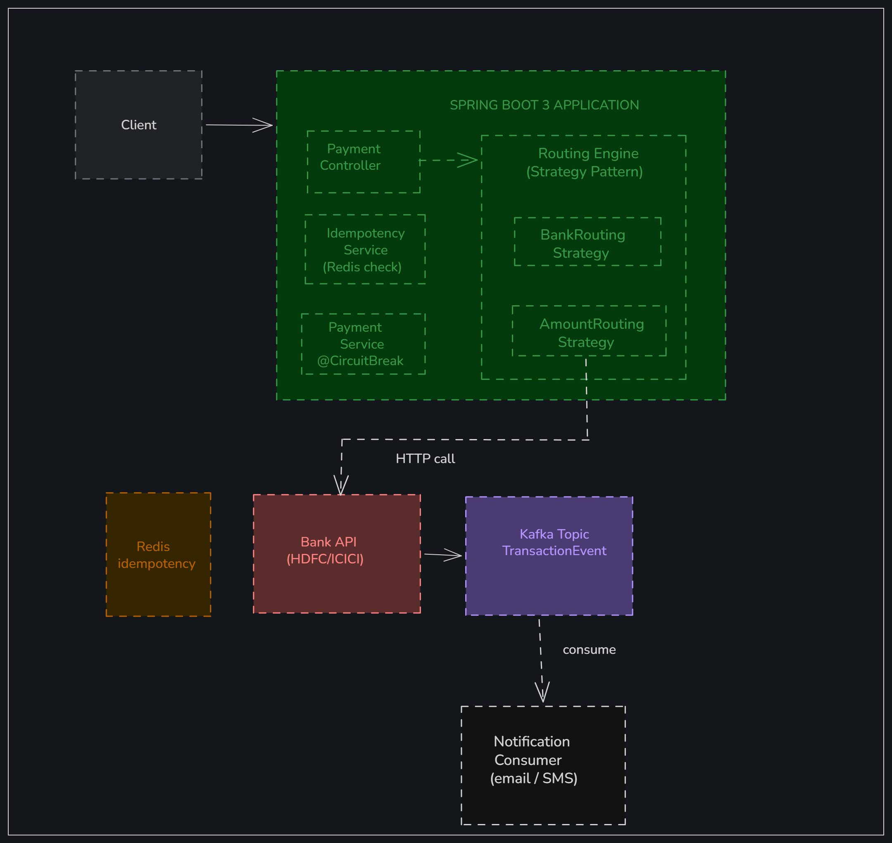

# Smart Payment Routing Engine

> A production-grade payment routing engine that selects the optimal bank gateway per transaction using the Strategy design pattern, with circuit breaking, idempotency, and event-driven audit trails.


## What it does

- Routes payments to HDFC / ICICI / SBI based on bank preference, amount, and payment method
- Idempotency: duplicate requests detected via Redis key (TTL 24h) — no double charges
- Circuit breaker on bank API calls via Resilience4j — auto-failover on bank downtime
- Every transaction publishes a Kafka event for audit trail and notifications
- Full API test suite: RestAssured + Testcontainers (real Redis in tests)

## Architecture



> **Design patterns used**
> - **Strategy Pattern** — BankRoutingStrategy, AmountRoutingStrategy implement RoutingStrategy interface
> - **Circuit Breaker** — Resilience4j wraps all bank API calls with retry + fallback
> - **Idempotency** — Redis stores request key → response mapping for 24 hours
> - **Event-driven** — Kafka TransactionEvent published on every payment outcome

## API Endpoints

| Method | Endpoint | Auth | Description |
|--------|----------|------|-------------|
| POST | `/api/payments` | Bearer JWT | Process a payment |
| GET | `/api/payments/{id}` | Bearer JWT | Get payment status |
| GET | `/api/payments/history` | Bearer JWT | Get transaction history |
| GET | `/api/routing/rules` | ADMIN | View current routing rules |
| PUT | `/api/routing/rules` | ADMIN | Update routing configuration |
| GET | `/actuator/health` | Public | Health check |
| GET | `/actuator/circuitbreakers` | ADMIN | Circuit breaker status |

## Payment request format

```json
{
  "amount": 5000,
  "currency": "INR",
  "preferredBank": "HDFC",
  "paymentMethod": "UPI",
  "merchantId": "MERCH_001",
  "idempotencyKey": "unique-uuid-per-request"
}
```

## How to run locally

### Prerequisites
- Java 21+
- Docker Desktop (for Redis + Kafka)

### Start dependencies
```bash
docker-compose up -d redis kafka
```

### Run the application
```bash
./mvnw spring-boot:run
```

### Run tests
```bash
./mvnw test
# Testcontainers spins up real Redis automatically
```

- Swagger UI: http://localhost:8080/swagger-ui.html

Write the Payment Router README
Open payment-router repo → click README.md → pencil icon → paste this
15 minutes
1
Full README template — click to expand and copy

## Project structure

```
payment-router/
├── src/main/java/com/payment/router/
│   ├── controller/     PaymentController
│   ├── routing/
│   │   ├── RoutingStrategy.java      (interface)
│   │   ├── BankRoutingStrategy.java
│   │   ├── AmountRoutingStrategy.java
│   │   └── RoutingEngine.java
│   ├── service/
│   │   ├── PaymentService.java       (@CircuitBreaker)
│   │   └── IdempotencyService.java   (Redis-backed)
│   └── kafka/
│       ├── TransactionEventProducer.java
│       └── NotificationConsumer.java
└── src/test/
    ├── PaymentControllerTest.java    (RestAssured)
    └── PaymentFlowIT.java            (Testcontainers)
```

## Why this project

This is based on a payment routing system I built professionally. It demonstrates:
- Enterprise patterns (Strategy, Circuit Breaker, Idempotency)
- Production concerns (no double charges, bank failover, audit trail)
- Full test coverage including infrastructure-level integration tests

## Author

**Gayatri Maurya** — Full Stack Developer, Mumbai
[LinkedIn](https://www.linkedin.com/in/gayatri-maurya-259293159/) · [GitHub](https://github.com/gayatri044)
